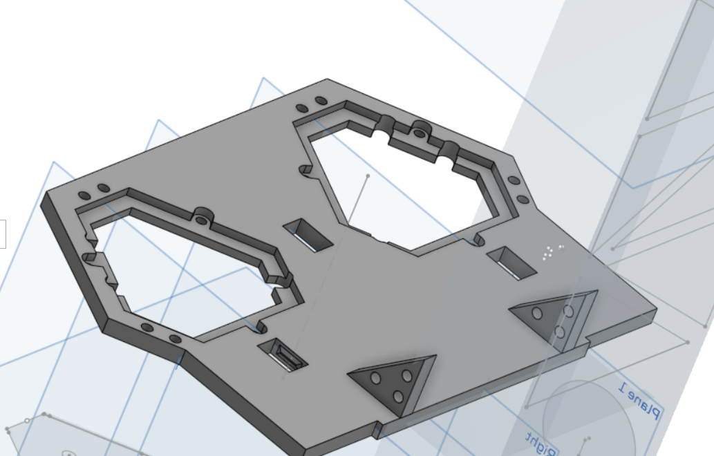
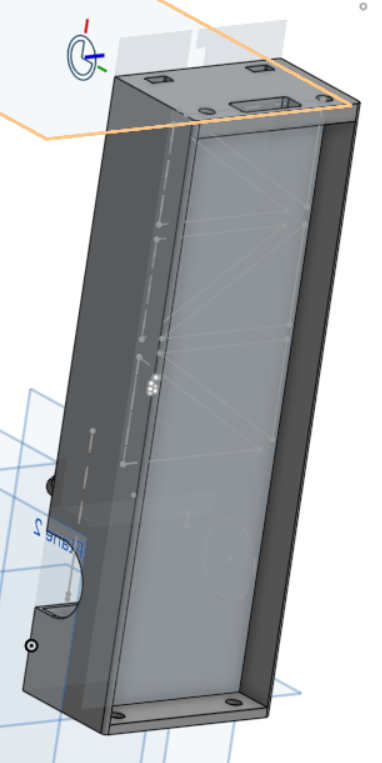
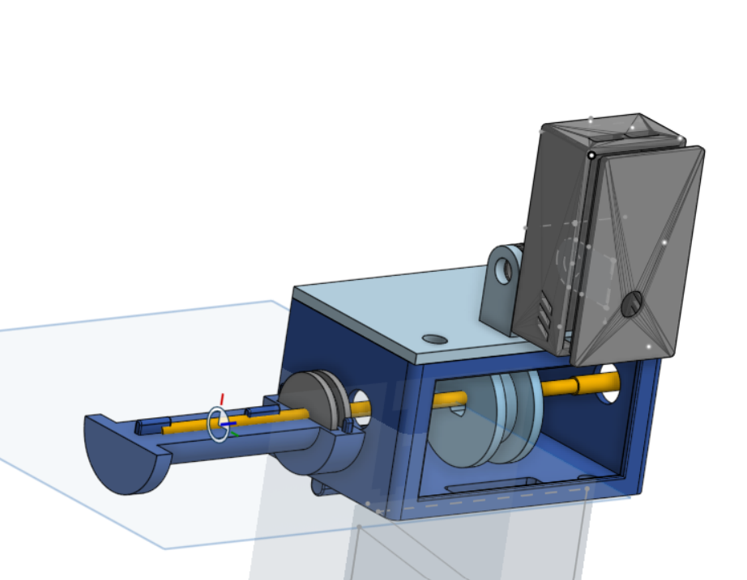
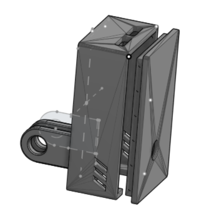
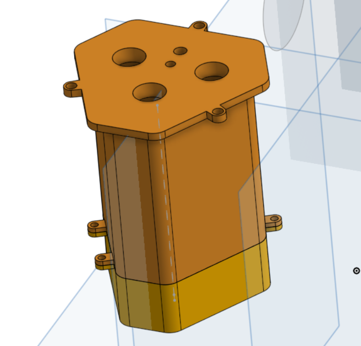

# ENG4061 - Projeto Empilhadeira Autônoma

## Peças 3D
### 1. Tampa do Chassi

A **tampa do chassi** é a peça central de interface entre o chassi metálico e os módulos impressos em 3D.

**Função e características:**
- Fixada diretamente no **chassi de metal** por meio de parafusos.  
- Possui **2 furos** para encaixe dos **suportes de bateria** (case das baterias).  
- Na parte frontal, há um **ressalto/sobreposição** onde é feita a conexão com a **guia do elevador**, através de **3 furos** para parafusos que garantem a fixação da guia.

---

### 2. Guia do Garfo

A **guia do garfo** é responsável por conduzir o movimento vertical do garfo ao longo do eixo **Y**.

**Função e características:**
- Possui encaixes para **2 cilindros de metal** que funcionam como **eixos guias**.  
- O garfo utiliza **rolamentos lineares** (mínimo 2, de 6 mm de diâmetro interno) que deslizam nesses eixos.  
- Na parte superior, há:
  - Um **furo para passagem do fio/cabo** que vem da polia.
  - Encaixes para a **caixa da polia**, que abriga a polia e o eixo.  
- Na lateral inferior existe uma região destinada à fixação do **motor lateral**, responsável por tracionar a polia do garfo (ver fotos do robô montado para referência).

---

### 3. Garfo

O **garfo** é o componente que efetivamente interage com o pallet, realizando o carregamento.

**Função e características:**
- Possui **seções verticais** para encaixe de pelo menos **2 rolamentos lineares**, que permitem o deslizamento suave sobre os eixos da guia.  
- Inclui uma **região específica para amarrar/fixar o cabo da polia**, responsável por subir e descer o garfo.  

**Pontos observados / melhorias futuras:**
- A **altura do garfo**, na configuração atual, fica **acima da altura do pallet**, o que pode dificultar o encaixe ideal.  
- A **espessura do garfo** ficou relativamente **fina**, podendo comprometer a robustez e a resistência mecânica.  
  - Melhorias sugeridas: reforçar a seção transversal e ajustar a altura para alinhar melhor com a altura do pallet.
 

---

### 4. Caixa da Polia

A **caixa da polia** é montada na região superior da **guia do garfo** e abriga o sistema de tração do garfo.

**Função e características:**
- Possui encaixes laterais para **rolamentos**, onde é inserido um **eixo** que gira a **polia interna**, responsável por subir/descer o garfo.  
- Devido ao comprimento limitado do eixo metálico disponível, foi necessário criar um **extensor de eixo em 3D**, composto por **duas peças (macho e fêmea)** que se encaixam entre si.  
- Esse extensor “abraça” uma **polia externa** de mesma medida da polia interna.

**Problemas e aprendizados:**
- Não foi considerado o **excesso lateral** existente em uma das laterais da polia, o que impactou o encaixe ideal.  
- O encaixe não levou em conta o **parafuso de fixação da polia no eixo**, o que dificultou a montagem correta.

**Tampa da caixa e suporte da câmera:**
- Na tampa da caixa foi criado um encaixe inspirado nos **suportes de GoPro** para acoplar a **caixa da ESP32-CAM**.  
- Entretanto, não foi considerado o caminho dos **eixos metálicos** que passam por essa região, o que dificultou a passagem do parafuso e da rosca para fixar a câmera no suporte.

---

### 5. Caixa ESP32-CAM

A **caixa da ESP32-CAM** foi um dos pontos de maior acerto do projeto.

**Função e características:**
- Encaixe praticamente **perfeito** para um módulo **ESP32-S3** (versão com **2 portas USB-C**).  
- Possui **aberturas de ventilação** para ajudar na dissipação de calor.

**Pontos de atenção / melhorias:**
- A longo prazo, as aberturas de ventilação atuais podem ser **insuficientes** para uso contínuo em cenários de maior aquecimento.  
  - Sugestão: ampliar a área de ventilação ou adicionar mais furos/grelhas na tampa.

---

### 6. Case das Baterias

A **case das baterias** é responsável por acomodar as baterias de alimentação do robô.

**Função e características:**
- Dimensionada para comportar **3 baterias**.  
- Encaixa na **tampa do chassi**, ficando **suspensa**, com furos para passagem de **parafusos e porcas** que garantem a fixação.  
- Possui uma **tampa inferior parafusável**, permitindo acesso às baterias para troca ou manutenção.

**Pontos de melhoria:**
- Internamente, seria interessante já prever, na parte superior, uma **região modelada para trilhas ou suportes de conexão elétrica**, permitindo:
  - Organização mais limpa dos contatos.
  - Redução do uso de **fios soltos ou molas**.
  - Facilitação da montagem e manutenção do conjunto de baterias.

---

