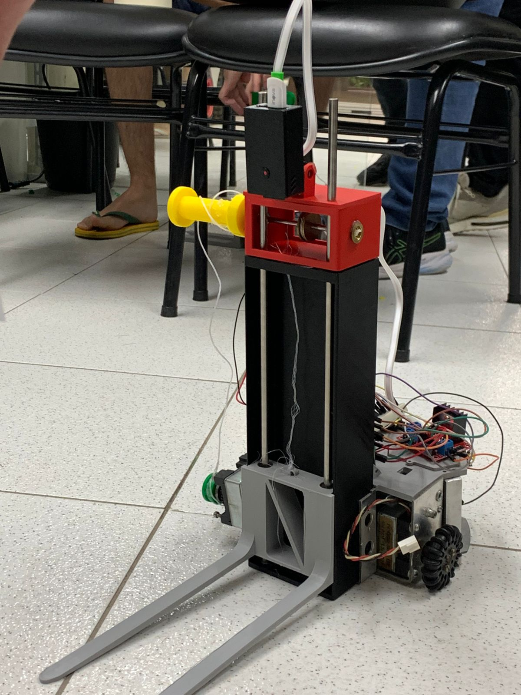
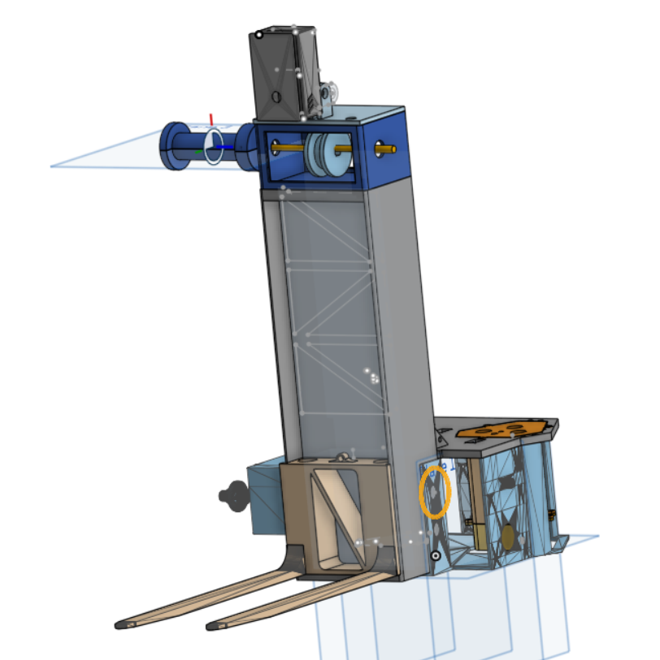
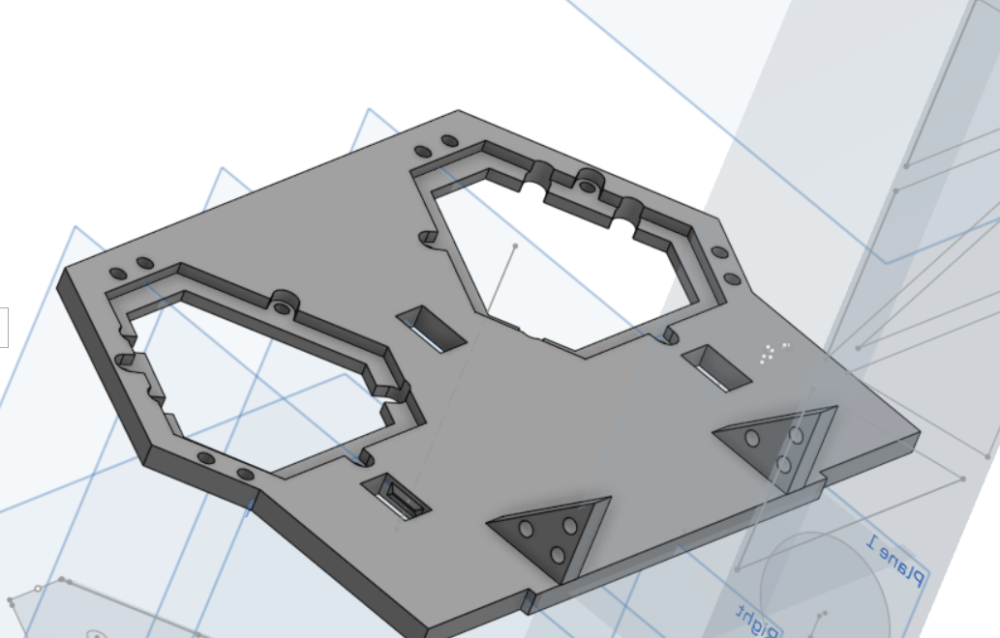
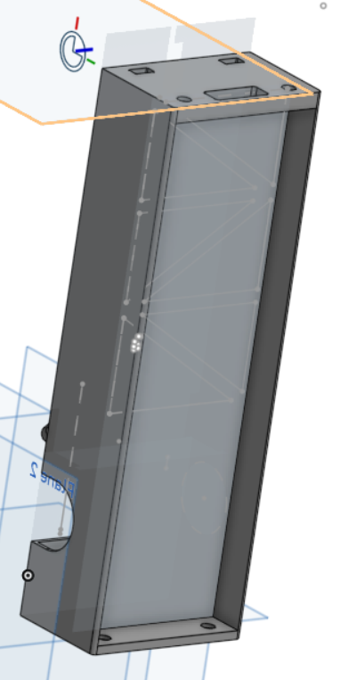
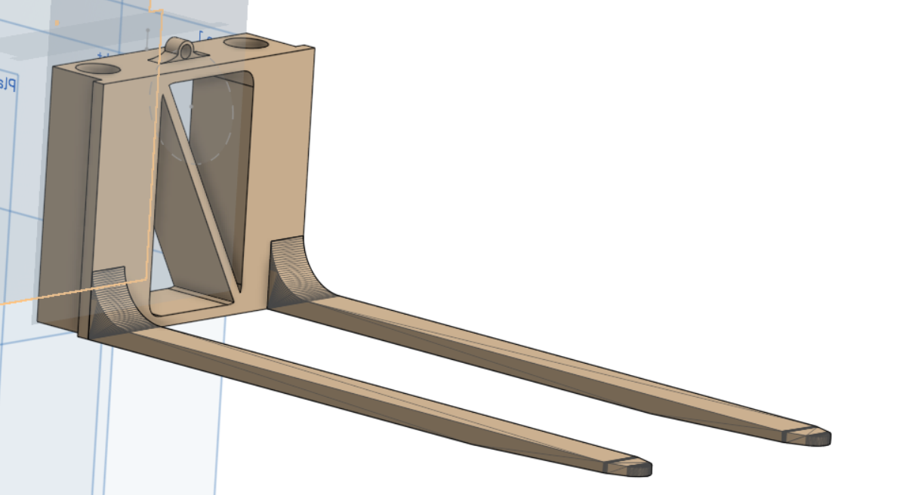
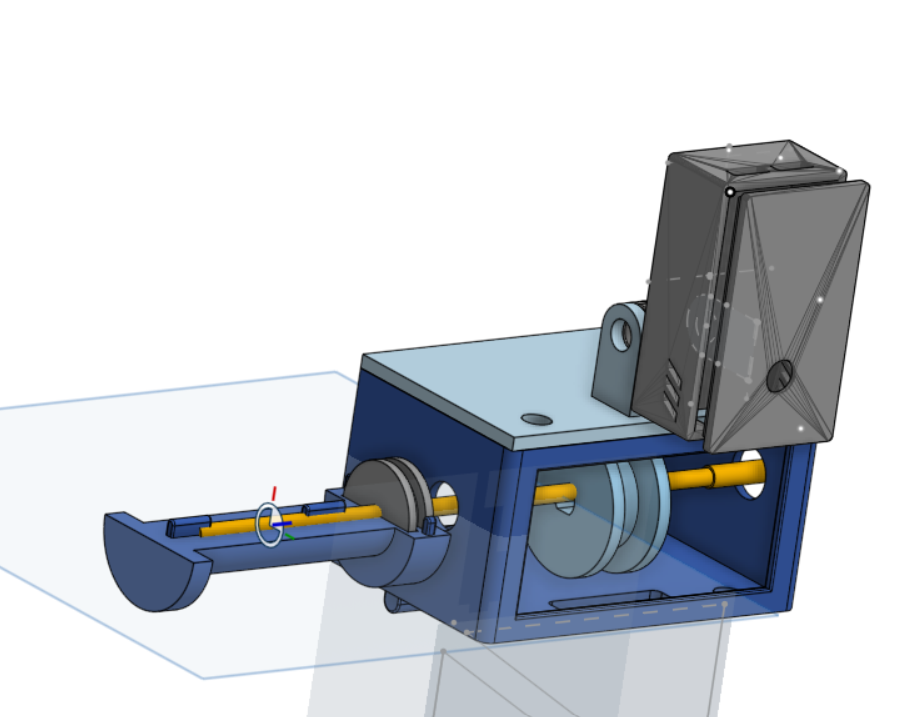
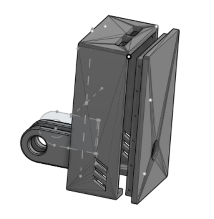
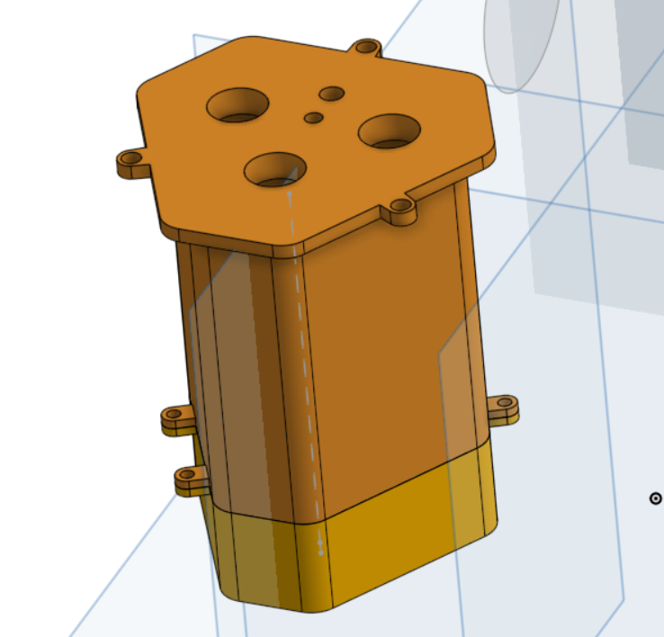

# Robotics - Autonomous Fork-Lif Project

## 3D Pieces

### 1. Chassis Cover

The **chassis cover** is the central interface piece between the metal chassis and the 3D printed modules.

**Function and characteristics:**
- Fixed directly to the **metal chassis** using screws.
- Has **2 holes** for fitting the **battery holders** (battery cases).
- On the front, there is a **protrusion/overlap** where the connection with the **elevator guide** is made, through **3 holes** for screws that ensure the guide is fixed.

---

### 2. Fork Guide

The **fork guide** is responsible for guiding the vertical movement of the fork along the **Y** axis.

**Function and characteristics:**
- It has slots for **2 metal cylinders** that function as **guide shafts**.
- The fork uses **linear bearings** (minimum 2, 6 mm inner diameter) that slide on these shafts.
- On the top, there is:
  - A **hole for the passage of the wire/cable** coming from the pulley.
  - Slots for the **pulley housing**, which houses the pulley and the shaft.
  - On the lower side there is a region intended for fixing the **lateral motor**, responsible for driving the fork pulley (see photos of the assembled robot for reference).

---

### 3. Fork

The **fork** is the component that effectively interacts with the pallet, performing the loading.

**Function and characteristics:**
- It has **vertical sections** for fitting at least **2 linear bearings**, which allow smooth sliding on the guide axes.
- It includes a **specific region for tying/fixing the pulley cable**, responsible for raising and lowering the fork.

**Points observed / future improvements:**
- The **height of the fork**, in the current configuration, is **above the height of the pallet**, which may hinder ideal fitting.
- The **thickness of the fork** is relatively **thin**, which may compromise robustness and mechanical resistance.
- Suggested improvements: reinforce the cross-section and adjust the height to better align with the height of the pallet.

---

### 4. Pulley Housing

The **pulley housing** is mounted on the upper part of the **fork guide** and houses the fork's drive system.

**Function and characteristics:**
- It has side slots for **bearings**, where a **shaft** is inserted that rotates the **inner pulley**, responsible for raising/lowering the fork.
- Due to the limited length of the available metal shaft, it was necessary to create a **3D shaft extender**, composed of **two pieces (male and female)** that fit together.
- This extender "embraces" an **outer pulley** of the same size as the inner pulley.

**Problems and lessons learned:**
- The **excessive lateral space** on one side of the pulley was not considered, which impacted the ideal fit.
- The fit did not take into account the **pulley fixing screw on the shaft**, which made correct assembly difficult.
**Case lid and camera mount:**
- A fitting inspired by **GoPro mounts** was created on the case lid to attach the **ESP32-CAM case**.
- However, the path of the **metal shafts** that pass through this area was not considered, which made it difficult to pass the screw and thread to secure the camera to the mount.

---

### 5. ESP32-CAM Enclosure

The **ESP32-CAM enclosure** was one of the project's greatest successes.

**Function and characteristics:**
- Virtually **perfect** fit for an **ESP32-S3** module (version with **2 USB-C ports**).
- Features **ventilation openings** to aid in heat dissipation.
  
**Points of attention / improvements:**
- In the long term, the current ventilation openings may be **insufficient** for continuous use in higher heat scenarios.
- Suggestion: enlarge the ventilation area or add more holes/grilles to the lid. mais furos/grelhas na tampa.

---

### 6. Battery Case

The **battery case** is responsible for housing the robot's power batteries.

**Function and characteristics:**
- Sized to hold **3 batteries**.
- Fits onto the **chassis cover**, remaining **suspended**, with holes for **screws and nuts** to secure it.
- Has a **screwable bottom cover**, allowing access to the batteries for replacement or maintenance.

**Points for improvement:**
- Internally, it would be beneficial to include, on the top, a **modeled area for electrical connection tracks or supports**, allowing for:
- Cleaner organization of contacts.
- Reduction in the use of **loose wires or springs**.
- Easier assembly and maintenance of the battery pack.

---

